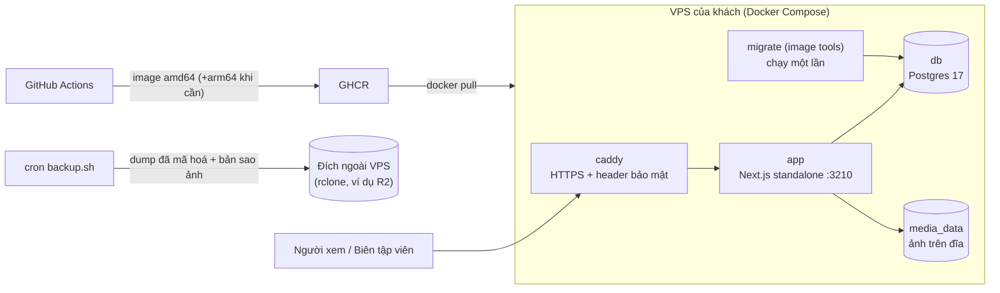

# CMS tự viết và hạ tầng VPS cho website Hoá chất An Phát

## Overview

Website hiện hoàn toàn tĩnh, toàn bộ nội dung nằm trong `src/data/*.ts`. Kế hoạch này thêm một CMS tự viết ngay trong app Next.js 16. Nhân viên của khách đăng bài và sửa thông tin công ty, và nội dung lên ngay mà không build lại. Mã nguồn được đóng gói thành **một Docker image chạy y hệt nhau** trên máy bạn, trên máy demo (chọn sau) và trên VPS riêng của từng khách.

Kế hoạch dựa trên phiên tư vấn ngày 2026-09-30 (yêu cầu đã được người dùng xác nhận) và báo cáo nghiên cứu [`researcher-260930-1659-nextjs16-selfhost-cms-stack.md`](../reports/researcher-260930-1659-nextjs16-selfhost-cms-stack.md). Kế hoạch đã qua red-team (15 phát hiện, đều được áp dụng) và một vòng validate.

## Quyết định của người dùng (không đảo ngược khi chưa hỏi)

1. **Phạm vi CMS:** bài viết/tin tức và thông tin công ty. **Sản phẩm vẫn nằm trong code** (`src/data/products.ts`).
2. **Người dùng:** cả dev lẫn nhân viên của khách, không biết code, đăng vài bài mỗi tuần.
3. **Tự viết CMS**, không dùng Payload hay Sanity.
4. **Nội dung lên ngay**, không build lại. Chấp nhận vận hành database.
5. **Hai vai:** biên tập viên viết và gửi duyệt; quản trị viên duyệt, đăng, quản lý tài khoản và thông tin công ty. **Biên tập viên được sửa mọi bài.**
6. **Giữ mô hình khối** cho bài viết (7 loại khối hiện có).
7. **Production:** mỗi khách một VPS. **Ảnh lưu trên ổ đĩa VPS** (volume Docker).
8. **Production khởi tạo bằng khung cài đặt:** không có bài mẫu hay logo mẫu. Dữ liệu mẫu đầy đủ chỉ dùng cho demo.
9. **Trước mắt chạy local cho mượt; nơi chạy demo quyết định sau.**
10. **Better Auth do người dùng tự triển khai.** Phase 5 chỉ nêu hợp đồng và checklist gợi ý, và sẽ được cập nhật theo báo cáo của người dùng.

## Non-goals

- Sản phẩm trong CMS; lưu form báo giá hoặc liên hệ vào DB.
- Ảnh scan chứng nhận và ảnh năng lực trong CMS (vẫn nằm trong code).
- Lịch sử phiên bản, hẹn giờ đăng, kéo thả khối, trình soạn thảo kiểu Word.
- Multi-tenant, nhiều instance app, CDN, lưu trữ object bên ngoài cho ảnh.
- Hướng dẫn sử dụng cho nhân viên khách hàng; tự động cảnh báo khi backup hỏng.

## Kiến trúc

- **Đọc công khai:** loader có cache theo tag (`articles`, `article:<slug>`, `site-settings`). Server Action làm mới tag sau khi ghi, nên nội dung lên ngay. Mô hình cache cụ thể (A: `cacheComponents`, B: `unstable_cache`) do spike ở phase 3 quyết định.
- **Bản đăng tách khỏi bản soạn:** `articles.published_snapshot` là bản đang hiển thị. Sửa bài đã đăng không ảnh hưởng site cho đến khi admin duyệt.
- **Ảnh:** `sharp` chuẩn hoá thành WebP, lưu trong `MEDIA_DIR`, phục vụ cùng domain qua `/media/*`.
- **Không có giá trị môi trường nào bị chốt lúc build:** không dùng `NEXT_PUBLIC_*`, `next build` không cần DB, và `db`/`auth` đều khởi tạo lười.
- **Ghi từ ngoài app** (seed, restore) kết thúc bằng restart `app`, vì cache nằm trong bộ nhớ của app.

## Phases

| # | Phase | Phụ thuộc | Effort | Status |
|---|-------|-----------|--------|--------|
| 1 | [Nền tảng database](./phase-01-database-foundation.md) | – | 1.5d | Pending |
| 2 | [Lưu trữ ảnh trên đĩa và xử lý media](./phase-02-media-storage.md) | 1 | 1d | Pending |
| 3 | [Seed dữ liệu và lớp đọc có cache](./phase-03-seed-and-cached-queries.md) | 1, 2 | 2d | Pending |
| 4 | [Chuyển trang công khai sang database](./phase-04-public-pages-from-db.md) | 3 | 3d | Pending |
| 5 | [Xác thực và phân quyền (Better Auth)](./phase-05-auth-and-roles.md) | 1 | người dùng tự làm | Pending |
| 6 | [Khung admin, upload ảnh, thông tin công ty](./phase-06-admin-shell-and-site-settings.md) | 2, 4, 5 | 2.5d | Pending |
| 7 | [Admin bài viết và luồng duyệt](./phase-07-admin-articles-and-review.md) | 2, 3, 5, 6 | 4d | Pending |
| 8 | [Đóng gói Docker và stack production](./phase-08-docker-production-stack.md) | 4 | 1.5d | Pending |
| 9 | [CI/CD, deploy, sao lưu, khôi phục](./phase-09-ci-deploy-backup-scripts.md) | 8 | 2d | Pending |
| 10 | [Diễn tập, nơi demo, tài liệu](./phase-10-demo-deploy-drills-docs.md) | 7, 9 | 1.5d | Pending |

Có thể làm song song: phase 5 (người dùng) chạy cùng lúc với 2–4, và phase 8–9 chạy cùng lúc với 6–7.

## Spike phải làm trước khi đi tiếp

| Spike | Ở phase | Nếu không đạt |
|-------|---------|---------------|
| Mô hình cache A (`cacheComponents`) đạt 4 tiêu chí: build không cần DB, 404 thật, có phần tĩnh, `updateTag` làm mới ngay | 3 | Mô hình B: `connection()` + `unstable_cache` + `revalidateTag(tag, { expire: 0 })`, chỉ sửa trong `src/server/queries/` và `src/server/cache-tags.ts` |
| `next/image` tối ưu được ảnh `/media/*` do route handler phục vụ | 2, kiểm lại ở 8 | `unoptimized` cho ảnh `/media/*` (ảnh đã được thu nhỏ lúc upload) |
| Server Action qua Caddy không lỗi origin | 8 | `header_up X-Forwarded-Host {host}` trong Caddyfile |
| CSP không làm hỏng trang | 8 | Chạy `Report-Only` rồi nới dần |

## Success Criteria

- [ ] Admin bấm "Duyệt và đăng" thì bài hiện ở `/tin-tuc` trong **≤ 5 giây**, không có build nào chạy.
- [ ] Biên tập viên sửa bài đã đăng thì site **không đổi** cho đến khi admin đăng lại.
- [ ] Gọi thẳng Server Action "đăng bài" hoặc "lưu thông tin công ty" bằng phiên `editor` thì bị từ chối, và DB không đổi.
- [ ] Sau seed demo, mọi trang công khai giống hệt trước khi chuyển: chữ hiển thị, mã HTTP và id heading (Playwright), cùng ảnh chụp ở 375px/1440px.
- [ ] URL không tồn tại, bài chưa đăng hoặc đã gỡ, sản phẩm sai slug đều trả **404 thật**.
- [ ] Tiêu đề chứa `</script>` không chạy được script trên trang công khai hay trang xem trước.
- [ ] `docker build` và `npm run build` thành công khi **không có** `DATABASE_URL` hay bí mật nào.
- [ ] Cùng một image chạy ở local, demo và VPS; `git grep -n "NEXT_PUBLIC_" src` không có kết quả.
- [ ] `deploy.sh --first-run` dựng xong một stack trống mà không can thiệp tay.
- [ ] Deploy gián đoạn **< 30 giây**; rollback về tag trước **< 5 phút** và không chạy migrate.
- [ ] Backup mỗi đêm gồm dump DB đã mã hoá và bản sao ảnh, nằm ngoài VPS; diễn tập khôi phục (kể cả qua ranh giới migration và khôi phục ảnh) thành công.
- [ ] *(Khi đã có nơi demo)* Dựng máy mới theo runbook **< 1 giờ**; `nmap` từ ngoài chỉ thấy 22, 80, 443.
- [ ] `npm test`, `npm run typecheck`, `npm run lint` sạch; CI xanh.

## Rủi ro chính

- **Mô hình cache của Next 16:** có spike 4 tiêu chí và phương án B.
- **Phase 4 chạm gần hết trang công khai:** chia commit theo bước, có so sánh bằng Playwright trước và sau.
- **Phase 5 do người khác làm và có thể lệch hợp đồng:** phase 6 và 7 chỉ dùng ba hàm guard; cập nhật plan khi có báo cáo.
- **Máy phát triển chưa có Docker:** phải cài trước phase 1.
- **Cả site phụ thuộc DB:** có cache trong bộ nhớ, error boundary, và health check tách liveness khỏi readiness.

## Dependencies

- Không phụ thuộc plan khác. Plan `260921-1610-website-an-phat` đã hoàn thành phần giao diện mà plan này giữ nguyên.

## Red Team Review

### Session — 2026-09-30

**Findings:** 15 sau khi gộp từ 38 phát hiện của 4 reviewer (15 accepted, 0 rejected). Người dùng duyệt từng phát hiện.
**Severity breakdown:** 1 Critical, 11 High, 3 Medium.

| # | Finding | Severity | Disposition | Applied To |
|---|---------|----------|-------------|------------|
| 1 | Stored XSS qua 3 thẻ JSON-LD (`breadcrumbs.tsx:31` bị bỏ sót), phase 7 khẳng định sai là không có XSS | Critical | Accept | 1, 4, 7 |
| 2 | Hợp đồng auth không khoá API HTTP của Better Auth | High | Accept (dưới dạng checklist gợi ý) | 5 |
| 3 | Hợp đồng auth thiếu `requireApiUser`, build không cần env, `src/proxy.ts`, proxy cắt body | High | Accept | 1, 5, 6 |
| 4 | Upload có thể làm app hết bộ nhớ | High | Accept | 2, 6, 8 |
| 5 | Deploy lần đầu phục vụ DB rỗng; ghi từ ngoài app không làm mới cache; `deploy.sh` hỏng trên VPS mới | High | Accept | 3, 8, 9, 10 |
| 6 | Seed ghi đè dữ liệu thật; khoá chống trùng ảnh không tồn tại | High | Accept | 1, 3 |
| 7 | Restore không qua được ranh giới migration; backup không mã hoá và xoá được; ảnh không được backup | High | Accept | 9, 10 |
| 8 | `deploy.sh` mất điểm rollback; `rollback.sh` vẫn chạy migrate | High | Accept | 9 |
| 9 | Cả site phụ thuộc DB, không có error boundary, health check trộn lẫn | High | Accept | 4, 8, 9 |
| 10 | Bọc cả cây trong Suspense làm mất 404 thật và hỏng phép so sánh giao diện; `cacheComponents` có thể không đem lại lợi ích | High | Accept (spike thêm tiêu chí) | 3, 4, 6 |
| 11 | Bảng `media` không biểu diễn được `SiteImage` (`position`, `credit`), logo bị mờ, thiếu `client-marquee.tsx` | High | Accept | 1, 2, 3, 4, 6 |
| 12 | Settings thiếu ràng buộc số lượng và trường; ảnh scan chứng nhận thừa | High | Accept (bỏ ảnh scan và ảnh năng lực khỏi CMS) | 3, 4, 6 |
| 13 | `not-found.tsx` trong `(site)` làm hỏng 404; route group sửa hai lần | Medium | Accept | 4, 6 |
| 14 | Id heading bị sinh lại; ngày sai định dạng hoặc múi giờ; thiếu `submitted_by`/`updated_by` | Medium | Accept | 1, 3, 7 |
| 15 | Thiếu header bảo mật; image và action chưa ghim; arm64 mặc định; `npm run lint` hỏng; `cache-tags` có nguy cơ thành endpoint công khai | Medium | Accept | 1, 3, 4, 6, 8, 9 |

### Whole-Plan Consistency Sweep

- Files reread: `plan.md`, `phase-01` … `phase-10`.
- Decision deltas checked: 12 (ảnh trên đĩa thay R2, hai chế độ seed, route group ở phase 4, `requireApiUser`, `/api/ready`, bỏ ảnh scan và ảnh năng lực, `submitted_by`/`updated_by`, `npm run lint`, amd64 mặc định, nơi demo để sau, đổi tên `phase-02-media-storage.md`, JSON-LD an toàn).
- Reconciled stale references: 9 (R2/S3 cho ảnh, `--force`, `npx eslint`, script kiểm tra import bằng shell, `proxy.ts` ở gốc, route group ở phase 6, health dùng DB, ảnh scan, `phase-02-object-storage.md`).
- Unresolved contradictions: 0. Các nhắc tới R2 còn lại đều đúng ngữ cảnh (R2 là đích backup được khuyến nghị).

## Validation Log

### Session 1 — 2026-09-30

Câu hỏi đã hỏi: 4.

| # | Câu hỏi | Quyết định | Tác động |
|---|---------|------------|----------|
| 1 | Ảnh production lưu ở đâu | Ổ đĩa VPS (volume Docker) | Phase 2 viết lại (bỏ R2/S3 cho ảnh); phase 8 thêm volume `media_data`; phase 9 backup cả ảnh; Render bị loại khỏi lựa chọn demo |
| 2 | Nội dung ban đầu của production | Trống + khung cài đặt | Phase 3 có `--demo` và `--settings-template`; trang chủ ẩn khối logo khi rỗng; `deploy.sh --first-run --seed=template` |
| 3 | Biên tập viên sửa bài của người khác | Được sửa mọi bài | Phase 7 cập nhật bảng quyền; rút lại bài theo `submitted_by` |
| 4 | Nơi chạy demo | Để sau, trước mắt chạy local | Phase 8 chạy stack ở `https://localhost`; phase 10 giữ bảng lựa chọn; build arm64 chỉ khi cần |

### Verification Results

- Tier: Full (10 phases); bốn reviewer red-team đã kiểm chứng trên codebase.
- Claims checked: khoảng 60. Verified: phần lớn. Failed (đã sửa trong plan): 6, gồm:
  - lời khẳng định "không có XSS";
  - `proxy.ts` đặt ở gốc repo;
  - hai định dạng khoá object không thống nhất;
  - thiếu `submitted_by`;
  - `npm run lint` hỏng;
  - mục Validation Log chưa tồn tại (nay đã có).
- Unverified còn lại (được giữ thành spike hoặc ghi chú):
  - hành vi của `cacheComponents` khi build;
  - optimizer với route handler;
  - `sharp` trong standalone;
  - tên tính năng khoá lưu trữ trên R2.

### Kết quả spike

- *(Điền khi làm phase 2, 3, 8.)*
